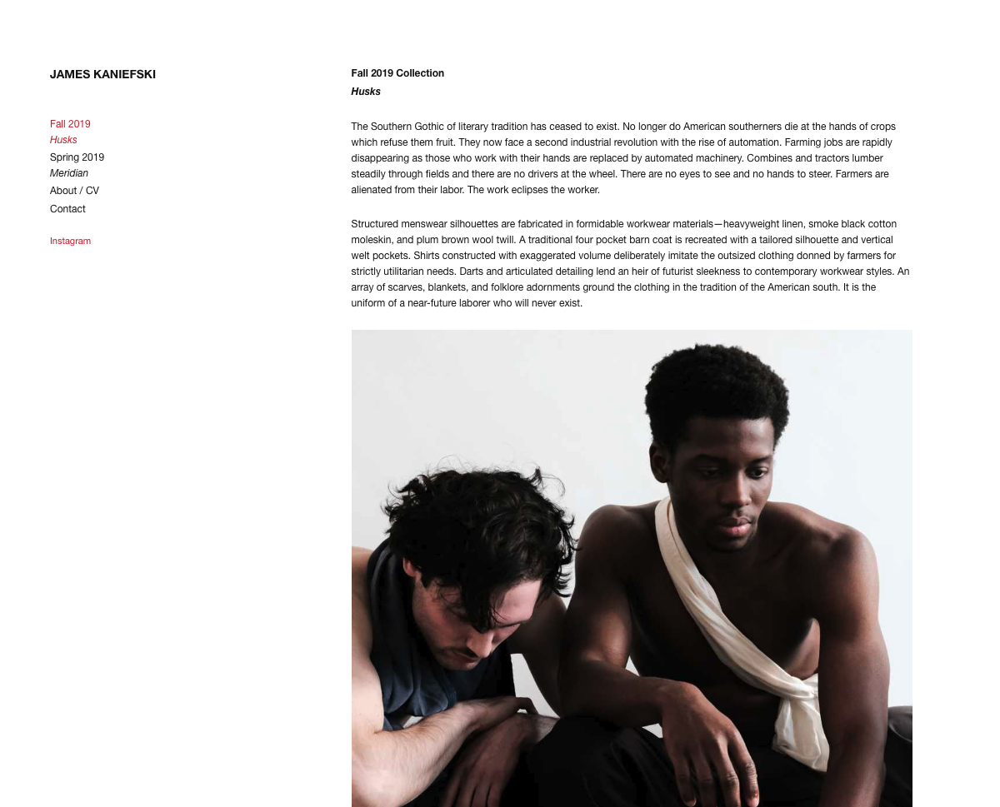

###### JAMES KANIEFSKI

[https://jameskaniefski.com](https://jameskaniefski.com)

James Kaniefski's was built on a GatsbyJS platform for its speed and efficiency, as well as  zero server hosting costs as all Node.JS packages are statically implemented into the site at build-time. In order to further streamline the website and design for long-term use, all content-related management has been offloaded to the client using GraphQL and a third-party content management system. GraphQL automatically generates all the pages in the website from markdown files, and the third-party CMS gives the client a clean and easy UI to update website content and add new pages, all while being integrated into a continuous-deployment environment leaving minimal maintenance overhead. To see James's website, click [here.](https://jameskaniefski.com)

